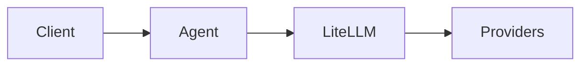
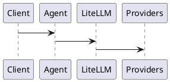
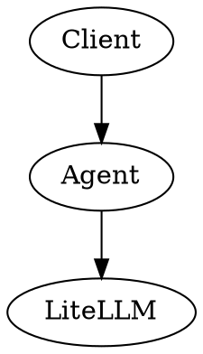

# DOCUMENTATION_GUIDELINES.md

# Documentation Guidelines

This project follows a **Docs-as-Code** approach.  
All documentation must be written in **open, text-based, machine-readable formats** that are easy for humans, engineers, and AI systems to read, modify, and version control.

Binary document formats should be avoided whenever possible.

---

# 1. Core Principles

Documentation must be:

- **Plain text**
- **Version-controllable**
- **Machine-readable**
- **AI-friendly**
- **Engineer-readable**
- **Open format**
- **Diff-friendly**

Preferred formats are those that integrate cleanly with:

- Git
- Markdown tooling
- Static documentation generators
- AI automation pipelines

---

# 2. Primary Documentation Format

All documentation must be written in Markdown (.md)

Reasons:

- human readable
- git diffable
- widely supported
- AI parsable
- works with static site generators
- editor-agnostic

Primary editing tools used in this project:

- **MarkText**
- **VSCode / Codium**
  - **Markdown Preview Enhanced** (VSCode / Codium extension)

Documentation may also be rendered as a site using **MkDocs**.

---

# 3. Diagram Formats

Diagrams must be defined using **text-based diagram languages** whenever possible.

Preferred order:

## Tier 1 — Universal diagrams : Mermaid

Supported by:

- GitHub
- MarkText
- Markdown Preview Enhanced
- MkDocs

Example:



---

## Tier 2 — Advanced engineering diagrams : PlantUML

Used for:

* sequence diagrams
* class diagrams
* C4 architecture
* state machines
* complex system modeling

Example:



---

## Tier 3 — Graph visualization : Graphviz / DOT

Used for:

* dependency graphs
* call graphs
* infrastructure topology
* DAG visualizations

Example:



---

## Tier 4 — Static diagrams : SVG

SVG is preferred over PNG for diagrams because it is:

* vector based
* editable
* open format
* diffable in many cases
* AI manipulable

Embed SVG in Markdown like:

```markdown

```

---

# 4. File Organization

Recommended documentation structure:

```
docs/
├─ architecture/
│  ├─ ai-stack.md
│  ├─ ai-stack.mmd
│  ├─ ai-stack.puml
│  ├─ ai-stack.dot
│  └─ ai-stack.svg
│
├─ design/
│  ├─ architectural-design-plan.md
│
├─ decisions/
│  ├─ adr-001-container-strategy.md
│
└─ README.md
```

This structure supports:

* modular diagrams
* reuse
* AI editing
* automated tooling

---

# 5. Architecture Decision Records

Important architectural decisions should be documented using **ADR (Architecture Decision Records)**.

Example file:

```
docs/decisions/adr-001-container-runtime.md
```

ADR structure:

```
# ADR-001: Container Runtime Choice

## Status
Accepted

## Context

## Decision

## Consequences
```

---

# 6. Diagrams as Code

All diagrams must be treated as **source code**, not exported binaries.

Good:

```
mermaid
plantuml
graphviz
svg
```

Avoid storing diagrams only as:

```
figma exports
draw.io binaries
screenshots
```

These formats prevent:

* version control diffs
* AI editing
* automated generation

---

# 7. Avoid Binary Document Formats

The following formats should **not be used as source documentation**:

```
PDF
DOCX
ODT
PPTX
```

Reasons:

* not diffable
* not machine readable
* poor git history
* difficult for AI tooling

These formats may only be used for **external distribution exports**, never as the source of truth.

---

# 8. Writing Style

Documentation should follow clear engineering structure.

Preferred section layout:

```
# Title

## Context
## Problem
## Architecture
## Components
## Interfaces
## Deployment
## Observability
## Failure Modes
## Security
## Future Work
```

Use:

* bullet lists
* diagrams
* short paragraphs
* explicit interfaces
* configuration examples

---

# 9. Rendering Workflow

Typical documentation pipeline:

```
Markdown
   ↓
Diagram DSL
   ↓
Editor Preview
   ↓
Git repository
   ↓
MkDocs site (optional)
```

Supported rendering environments:

* MarkText
* VSCode + Markdown Preview Enhanced
* MkDocs
* GitHub (Mermaid only)

---

# 10. AI Integration

Documentation should remain **AI-friendly**.

Guidelines:

* avoid embedded binary blobs
* keep diagrams in text DSLs
* keep documents modular
* maintain semantic headings
* avoid excessive formatting

This allows:

* automated editing
* diagram generation
* code/document synchronization
* architecture analysis

---

# 11. Recommended Documentation Philosophy

This project follows:

```
Docs as Code
Architecture as Code
Infrastructure as Code
```

Documentation should evolve with the system and remain:

* accurate
* maintainable
* reproducible

---
