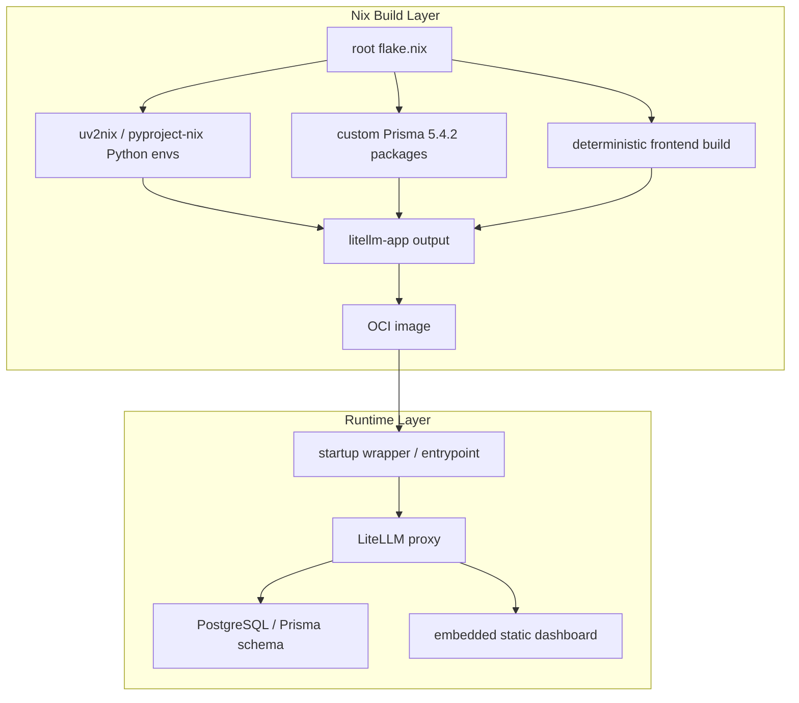

# LiteLLM-Nix Architecture

## Purpose

`litellm-nix` is a fork of upstream [LiteLLM](https://github.com/BerriAI/litellm) that adds a reproducible Nix-based packaging and deployment layer.

The fork is intentionally narrow in scope:

- keep upstream LiteLLM application code as intact as possible
- build a Nix-native development and container workflow around it
- build an **OCI image** using `nixpkgs` and `dockerTools`, embedding
  the Python environment, proxy server and dependencies.
- make the proxy easier to run in homelab and declarative environments

This document describes the architecture that actually exists today, and separates that from future work.

## Implemented Architecture

### 1. Root Flake as the Build Orchestrator

The authoritative Nix entrypoint is the root `flake.nix`.

It is responsible for:

- creating Python environments with `uv2nix` and `pyproject-nix`
- packaging custom Prisma 5.4.2 engines and CLI
- building the dashboard frontend in a deterministic two-stage flow
- assembling a final application output
- producing an OCI image with `dockerTools.buildLayeredImage`
- exposing multiple development shells

### 2. Custom Prisma Packaging

The root flake depends on two custom derivations:

- `nix/prisma-engines-5_4_2.nix/`
- `nix/prisma-5_4_2.nix/`

These exist because upstream LiteLLM currently depends on
`prisma-client-py` v0.11.x, which expects Prisma 5.4.2-era behavior,
while current nixpkgs Prisma packages are newer.

The custom packages let the fork stay closer to upstream Python
dependencies while still building in a Nix-friendly way.

### 3. Frontend Build Pipeline

The dashboard in `ui/litellm-dashboard/` is built in two stages:

1. a fixed-output derivation fetches dependencies
2. an offline build consumes those dependencies and emits static output

That output is copied into LiteLLM's proxy UI path during the final app
assembly step.

### 4. Final Application Output

The root flake assembles a final app artifact that contains:

- the runtime Python environment
- generated Prisma client code
- the built proxy UI
- runtime libraries needed by the packaged application

From there, the flake builds an OCI image and a small startup wrapper
that can optionally run Prisma migrations before launching
`python -m litellm`.

### 5. Runtime and Deployment Assets

The Nix layer currently includes:

- `nix/container/compose.yaml`
- `nix/container/entrypoint.sh`
- `nix/prisma/migrate.sh`

The Compose file is the main concrete deployment example in this fork
today. It wires in secrets, host services such as PostgreSQL and
Qdrant, and the runtime environment expected by LiteLLM.

## Current Architecture Diagram



## Current Repository Layout for the Nix Layer

```text
nix/
├── AGENT.md
├── container/
│   ├── compose.yaml
│   ├── entrypoint.sh
│   └── state/
├── docs/
│   ├── architecture/
│   ├── diagrams/
│   └── roadmap/
├── modules/
├── overlay/
├── prisma/
│   ├── migrate.sh
│   └── prisma_migration.py
├── prisma-5_4_2.nix/
├── prisma-engines-5_4_2.nix/
└── flake-old.nix
```

## Planned Architecture

The following are still planned or optional, not current implementation:

- Provide a **NixOS module** under `nix/modules/` to enable and manage the proxy as a system service.
- Offer an **overlay** so that Nixpkgs users can pull the package via
  the `pkgs.litellm` attribute. 
- Supply **deployment manifests** for Docker Compose and optional k3s.

These should be described as future work unless the corresponding files actually exist.

## Design Constraints

- Keep the fork close to upstream LiteLLM to reduce merge pain.
- Prefer packaging-layer fixes over application-layer divergence.
- Treat `nix/flake-old.nix` as a legacy reference, not the active design.
- Keep documentation aligned with the real tree so both humans and AI
  agents can trust it.
