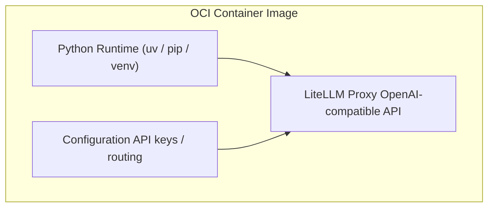

# LiteLLM‑NixOS‑Container: Architectural Design Plan

## Purpose and Scope

The **litellm‑nixos‑container** repository packages the
[LiteLLM](https://github.com/BerriAI/litellm) project into a
reproducible, containerised service built using Nix. Its purpose is not
to change the core LiteLLM codebase but to:

- Build an **OCI image** using `nixpkgs` and `dockerTools`, embedding
  the Python environment, proxy server and dependencies.
- Provide a **NixOS module** to enable and manage the proxy as a
  system service.
- Offer an **overlay** so that Nixpkgs users can pull the package via
  the `litellm` attribute.
- Supply **deployment manifests** for Docker Compose and optional k3s.

This design ensures that the proxy can run in an air‑gapped homelab and
easily integrate with NixOS infrastructure.

## High‑Level Architecture

The container itself is simple: it runs the **LiteLLM proxy server**
along with any runtime dependencies. The design focuses on
reproducibility, configuration and integration.



### Container Build Workflow

1. **Python environment**: The flake uses the `uv2nix` machinery to
   build a deterministic Python environment from `requirements.lock`.
   It ensures that the exact versions of `litellm` and dependencies are
   installed.
2. **Docker image**: `pkgs.dockerTools.buildLayeredImage` assembles
   layers: base (e.g. alpine / busybox), Python environment,
   application code and `entrypoint.sh`. The result is an OCI image
   with minimal size and no hidden network fetches.
3. **Entrypoint**: A simple `entrypoint.sh` calls `litellm` with the
   config file and passes through environment variables. A small init
   system (`tini`) reaps zombie processes.
4. **Configuration**: The container reads `/etc/litellm.yaml` for
   routing rules (providers, API keys, context windows). Keys are
   injected via environment variables or mounted secrets.

### NixOS Module

The module exposes a `services.litellm` option that can be enabled with:

```nix
    services.litellm.enable = true;
    services.litellm.settings = {
    port = 4000;
    configFile = \"/etc/litellm.yaml\";
        logLevel = \"info\";
        *\# optional: environment variables (API keys) loaded via sops*
    };
```

Under the hood the module will:

- Pull the container image via `pkgs.dockerTools.buildLayeredImage` or
  from a registry.
- Create a `systemd` service to run the container with proper
  networking and volume mounts.
- Provide a `liteLLM.yaml` template in
  `/nixos/litellm-nixos-container/container/litellm.yaml` that defines
  providers, routing, cost tracking and context windows.

### Overlay

A small overlay in `nixos/overlay/default.nix` overrides the `litellm`
package in `pkgs` with the one built from this flake. This allows others
to write:

```nix
{ pkgs, \... }:
{
    environment.systemPackages = \[ pkgs.litellm \];
}
```

### Deployment Manifests

- **container.nix** under `nixos/container` describes the container
  environment using NixOS container definitions; it sets up
  networking, volumes (e.g. /var/lib/litellm for logs), and exposes
  port 4000.
- **compose.yaml** provides a reference Docker Compose service for
  development outside of NixOS. It defines environment variables,
  mounts the config file, and sets restart policies.
- **k8s/** holds a `deployment.yaml` and `service.yaml` for deploying
  the proxy into a Kubernetes cluster; it sets resource limits,
  environment variables and secrets via ConfigMaps and Secrets.

### Configuration File

`litellm.yaml` contains routing and pricing configuration. Example
skeleton:

```yaml
model_list:
- name: openai/gpt-3.5-turbo
  max_tokens: 4096
  api_base: https://api.openai.com/v1
- name: together/gpt-3.5-turbo
  max_tokens: 4096
  api_base: https://api.together.xyz/v1

router:
    strategy: cost_based

    order:
    - openai/gpt-3.5-turbo
    - together/gpt-3.5-turbo

    cost_tracking:
    - enable: true
    - currency: USD
```

Secrets (API keys) must **not** be stored in this file; they are
provided via environment variables or NixOS secrets.

## Directory Structure

Within this repo (on the `nixos-container` branch), the layout is:

```
.
├── README.md \# explains the purpose of the fork and points to upstream
├── flake.nix \# builds the container image and defines outputs
├── nixos/
│   ├── AGENTS.md \# instructions for agent tooling
│   ├── README.md \# high‑level explanation of the Nix packaging
│   ├── container/
│   │   ├── container.nix
│   │   ├── entrypoint.sh
│   │   ├── litellm.yaml
│   │   └── compose.yaml
│   ├── modules/
│   │   └── litellm-proxy.nix
│   ├── overlay/
│   │   └── default.nix
│   ├── devshell/
│   │   └── shell.nix
│   ├── scripts/
│   │   ├── build-container.sh
│   │   └── test-proxy.sh
│   └── k8s/
│       ├── deployment.yaml
│       └── service.yaml
└── upstream/ \# upstream LiteLLM source (forked)
```

## Future Directions

- **Version tracking**: automatically monitor upstream
  `BerriAI/litellm` releases; update `requirements.lock` and container
  image in CI.
- **Custom providers**: add modules or overlay definitions for local
  models (e.g. Mistral, LM Studio) and route them via LiteLLM.
- **Observability**: integrate Prometheus exporter into the container
  (e.g. export token counts and error rates). Use a NixOS module to
  collect these metrics.
